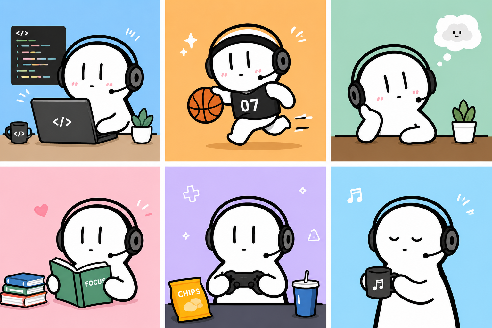
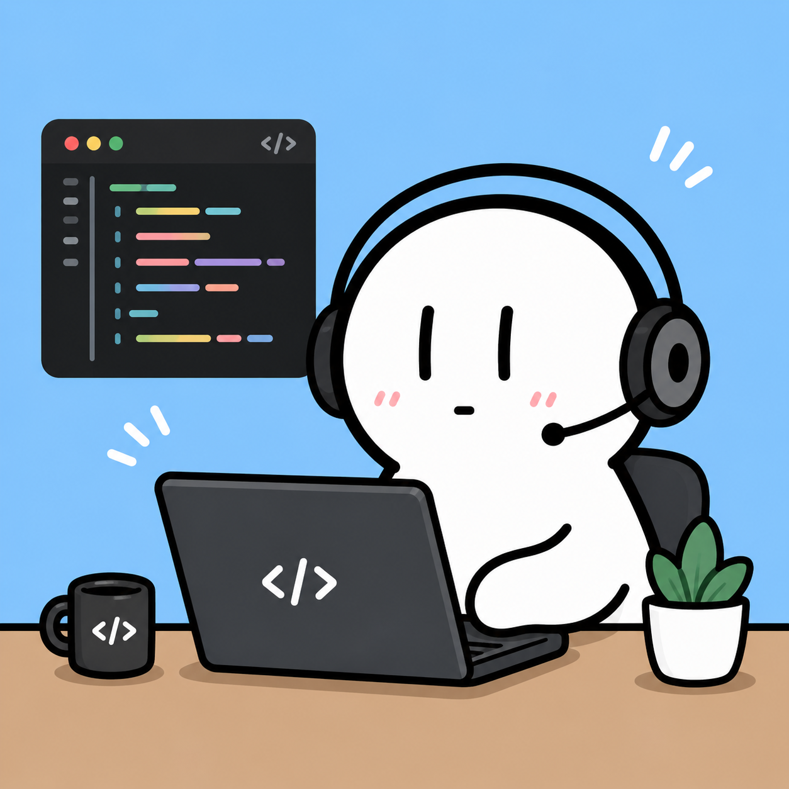
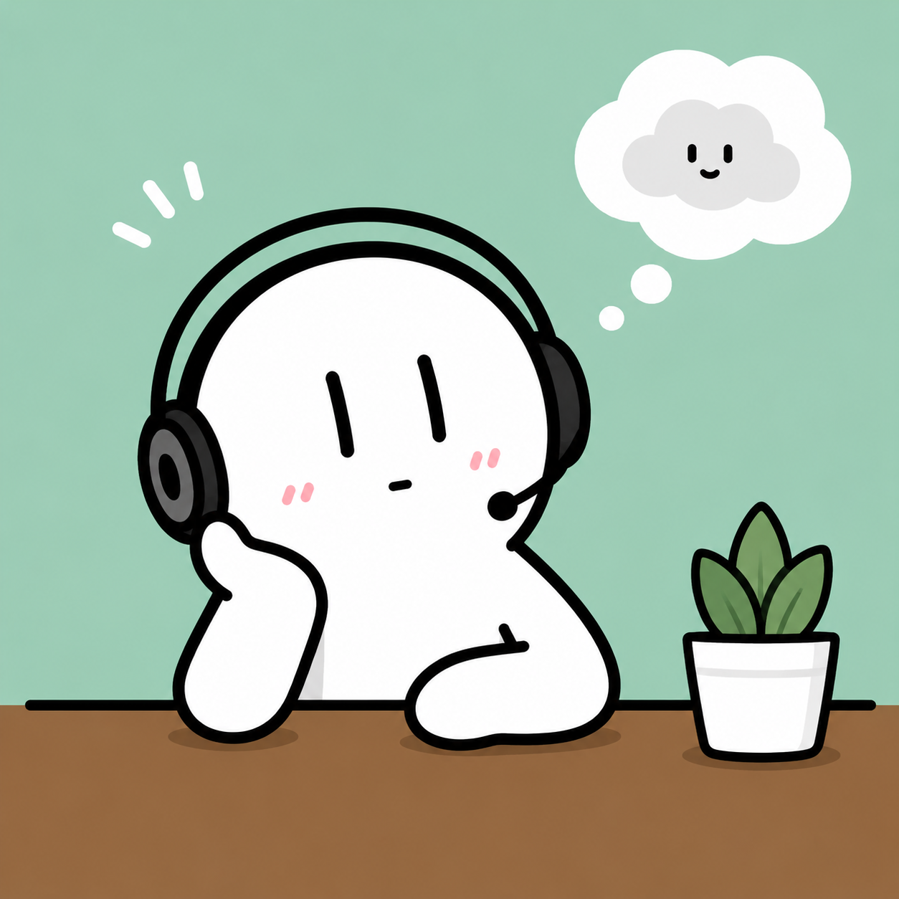

# 👋 I'm xuezhaju

*C++ Learner | Godot Enthusiast | Game Development Dreamer*

 

<picture>
  <source media="(prefers-color-scheme: dark)" srcset="https://raw.githubusercontent.com/xuezhaju/xuezhaju/output/github-snake-dark.svg" />
  <source media="(prefers-color-scheme: light)" srcset="https://raw.githubusercontent.com/xuezhaju/xuezhaju/output/github-snake.svg" />
  
</picture>

 

## 🏞️ Banner

  

 

## 👋 About Me

  
  
  

 

- 🌱 I'm currently learning **C++ , vue and Godot Engine**
- 💻 My Bilibili: [xuezhaju](https://space.bilibili.com/3493127857900357)
- 📫 How to reach me: [liaozecheng123@163.com](mailto:liaozecheng123@163.com)
- 🔭 My goal: **Game Development with C++**

 

## 📌 Current Status

- **Main Focus**: C++ Language Learning
- **Secondary Learning**: Godot Game Engine
- **Learning Phase**: Basic Syntax → Project Practice
- **Learning Style**: Reading + Coding + Note-taking

 

## 📚 Learning Path

<strong>C++ Core</strong> (点击展开)

- ✅ Basic Syntax (Completed)
- ⏳ Pointers & Memory Management (In Progress)
- 📅 STL Standard Library
- 📅 Object-Oriented Design
- 📅 Project Practice

<strong>Godot Applications</strong> (点击展开)

- 📅 GDScript Basics
- 📅 Game Development Process
- 📅 C++ and Godot Integration

 

## 📊 GitHub Stats

 

**Social**: [GitHub](https://github.com/xuezhaju) | [Bilibili](https://space.bilibili.com/3493127857900357) | [Email](mailto:liaozecheng123@163.com) | QQ: 3883453752

 

 

 

 

 

---

📧 liaozecheng123@163.com | 💬 QQ: 3883453752 | 🎮 Bilibili: [xuezhaju](https://space.bilibili.com/3493127857900357)

✨ Learning never stops ✨
